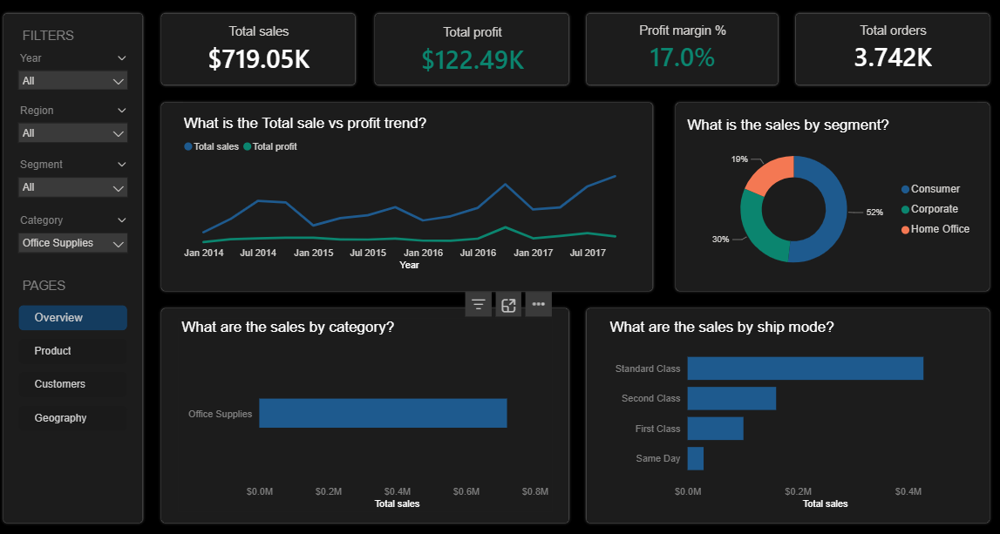
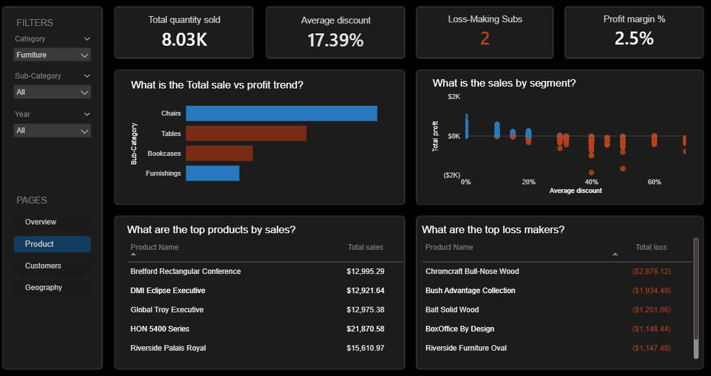
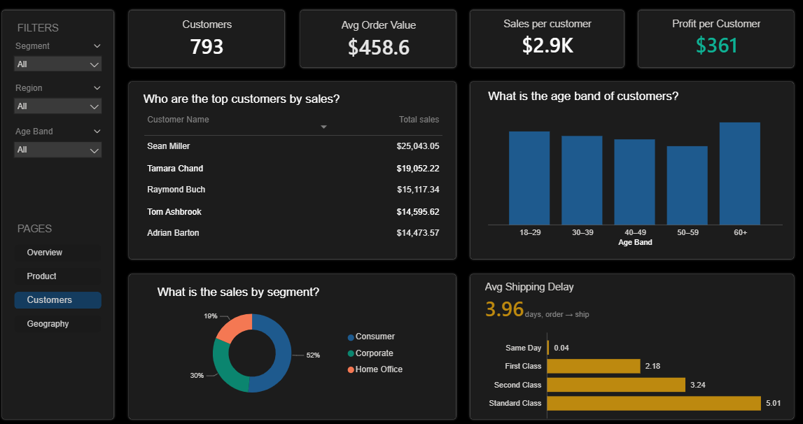
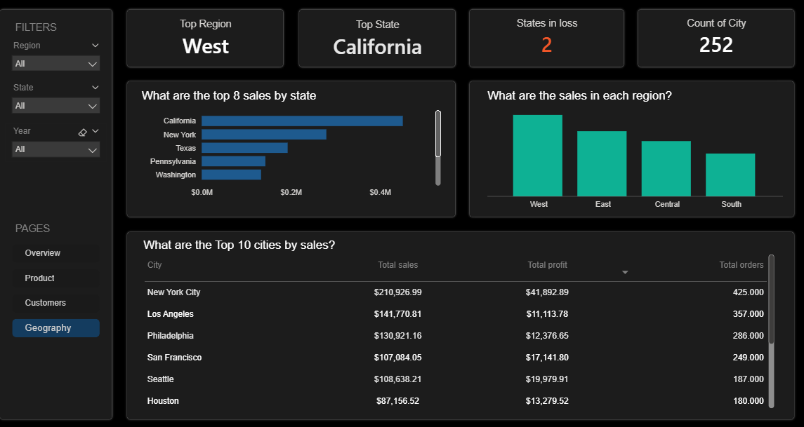

# Superstore Sales Performance — Power BI Dashboard

An interactive Power BI dashboard that turns raw sales transactions into decision-ready KPIs. Built on the classic three-table Superstore data model (Sales, Customer, Product), spanning **FY2014–FY2017**.

## Overview

The report is organised into four pages, each answering a different business question:

| Page | Question it answers |
|------|---------------------|
| **Overview** | How are we doing overall? |
| **Product** | Where is margin won and lost? |
| **Customer** | Who buys, and how much? |
| **Geography** | Where does it sell? |

## Dashboard preview

> Add your exported PNGs to the `images/` folder using the filenames below and they will render here automatically.

### Overview


### Product analysis


### Customer analysis


### Geography


## Key KPIs

**Headline**
- Total Sales, Total Profit, Profit Margin %
- Total Orders, Average Order Value (AOV), Total Customers

**Time intelligence**
- Sales & Profit trend (monthly)
- YoY growth %, YTD sales/profit, MoM growth %

**Product**
- Sales & Profit by Sub-Category (profit colour-coded)
- Discount vs Profit (the core insight — deep discounts erode margin)
- Loss-making sub-categories, Top loss-making products

**Customer**
- Sales / Customer, Profit / Customer
- Customers by age band
- Average shipping delay (order → ship)

**Geography**
- Sales & Profit by state / region
- Top region, top state, states in loss, top cities

See [`DAX_MEASURES.md`](DAX_MEASURES.md) for the full list of measures and calculated columns.

## Data model

A star schema: the `Sales` fact table joins to two dimension tables and a date table.

```
Customer (dim) ──< Sales (fact) >── Product (dim)
                     │
                     └──< Date (dim)   (Sales[Order Date] → Date[Date])
```

Relationships:
- `Sales[Customer ID]` → `Customer[Customer ID]`
- `Sales[Product ID]` → `Product[Product ID]`
- `Sales[Order Date]` → `Date[Date]` (marked as the date table)

## Data source

| File | Grain | Key fields |
|------|-------|-----------|
| `Sales.csv` | one row per order line (~9,994) | Order/Ship Date, Ship Mode, Sales, Quantity, Discount, Profit |
| `Customer.csv` | one row per customer (793) | Segment, Age, Country, City, State, Region |
| `Product.csv` | one row per product (1,862) | Category, Sub-Category, Product Name |

> Raw data files are excluded from version control by default — see `.gitignore`.

## Tools

- Microsoft Power BI Desktop
- DAX (measures + calculated columns)
- Power Query (data load & type shaping)

## Getting started

The finished report is included as [`sales_dashboard.pbix`](sales_dashboard.pbix) — open it in Power BI Desktop to explore the interactive dashboard directly.

To rebuild it from scratch:

1. Open Power BI Desktop.
2. `Get Data → Text/CSV` and load `Sales.csv`, `Customer.csv`, `Product.csv`.
3. Create the Date table and relationships (see `DAX_MEASURES.md`).
4. Add the measures, then build the visuals for each page.

## License

Released under the [MIT License](LICENSE).
